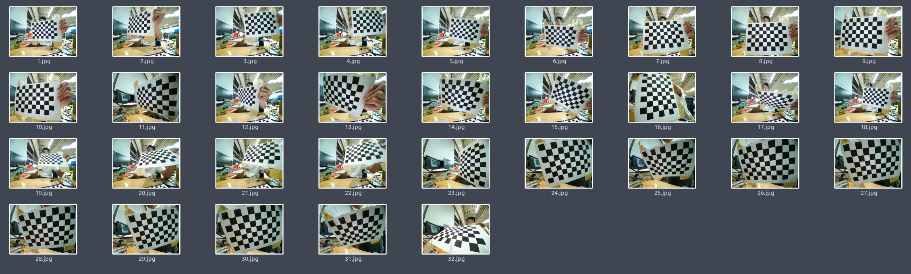

# FisheyeCameraCalibration

## 鱼眼矫正方法

**Step1**
`img_catcher.cpp`   

修改指定保存的文件夹目录

````cpp
string filename = "/home/chrisliu/NewDisk/ROSws/img_ws/src/img_extract/catch_imgs/";
````

保存30张含有棋盘的照片,按`q`保存.

所保存的棋盘照片应尽量凸显镜头畸变,覆盖镜头各个位置,角度等,如下




**Step2**

`fisheye_calibration.cpp`   读取保存的棋盘照片获取相机内参

自行修改代码中的相关路径


TODO: 有空更新一般相机


**Step3**

查看矫正后的视频流

`fisheye_undistort.cpp`

对应的ROS节点，实现发布矫正后的图像节点

`fisheye_undistort_node.cpp`


## 其他功能

`fisheye_undistort_node_sub.cpp`	订阅图片节点进行矫正并发布

`videSaver.cpp`	保存视频流为`avi`文件